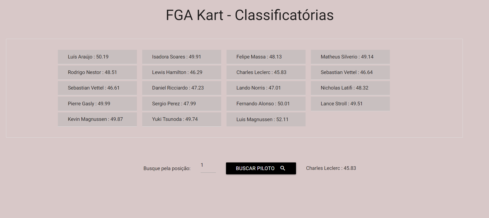

# Classificatório FGA Kart

**Número da Lista**: X 
**Conteúdo da Disciplina**: Dividir e Conquistar 

## Alunos

| Matrícula  | Aluno                           |
| ---------- | ------------------------------- |
| 18/0042661 | Luís Fernando Furtado de Araújo |
| 18/0122606 | Isadora Soares                  |

## Sobre

O FGA Kart está com um temporizador automatizado que registra a volta dos competidores. Porém, ainda não há a disponibilidade de um sistema que pega todos os pilotos e calcula a classificação de cada um. Dessa forma, esse algoritmo pretende retornar o usuário que foi classificado de acordo com o tempo que foi feito por ele em segundos para o circuíto.

## Screenshots

## Instalação

**Linguagem**: Javascript 

Navegador atualizado.

## Rodar a aplicação

Requisito: Ter um navegador atualizado.

Execução: Para executar o projeto basta abrir o arquivo index.html no navegador de sua preferêcia.

## Como utilizar

Escolha uma colocação e coloque no input para saber qual competidor está nessa referida posição.

## Vídeo 

https://drive.google.com/file/d/1yk3sYES79ZyHyFw5OIy1FNqAxKhKd_HJ/view?usp=sharing
